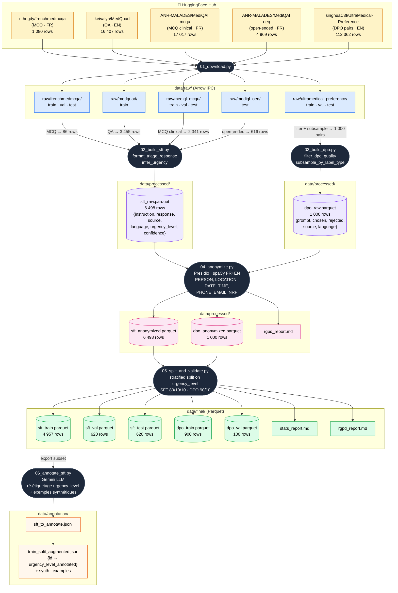

# Data Lineage — Project 14

Pipeline complet de `data/raw/` vers `data/final/`, en 7 scripts numérotés.

## Résumé des étapes

| Script | Entrée | Sortie | Transformation clé |
|--------|--------|--------|--------------------|
| `01_download.py` | HuggingFace Hub | `data/raw/` (Arrow) | Téléchargement + cache local |
| `02_build_sft.py` | 4 raw datasets | `sft_raw.parquet` (6 498 rows) | MCQ/QA → `instruction/response` + `infer_urgency` |
| `03_build_dpo.py` | ultramedical raw | `dpo_raw.parquet` (1 000 rows) | Filtrage qualité + sous-échantillonnage stratifié |
| `04_anonymize.py` | sft_raw + dpo_raw | `*_anonymized.parquet` | Presidio (spaCy FR+EN) sur 6 entités RGPD |
| `05_split_and_validate.py` | *_anonymized | `data/final/*.parquet` | Split stratifié (urgency_level) 80/10/10 |
| `06_annotate_sft.py` | sft_train subset | `train_split_augmented.json` | Ré-étiquetage + génération synthétique via Gemini |

## Schémas des fichiers finaux

**SFT** — `{instruction, response, source, language, urgency_level, confidence}`
**DPO** — `{prompt, chosen, rejected, source, language}`
